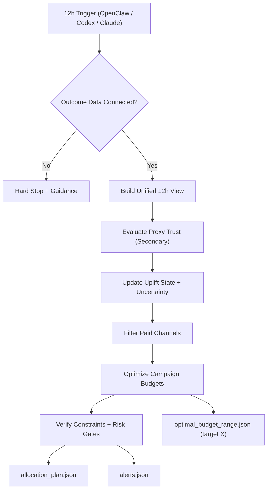

# Uplift Allocator Skill

**An autonomous Agent Skill for consistent, reliable 12-hour optimization of paid marketing budgets.**

Uplift Allocator is a high-complexity optimization system for steering advertising accounts from strategy level to campaign level. The AI runtime owns orchestration. The mathematical control logic owns consistency.

## 12-Hour autonomous AI loop

Designed for autonomous execution every 12 hours by:
- OpenClaw
- ChatGPT Codex
- Claude

Each cycle produces budget recommendations, reliability checks, and explainability artifacts.

## Core value

- Reliable campaign budget steering with strict risk controls.
- Incremental uplift optimization with proxy signals treated as secondary.
- Paid-channel-only allocation to protect spend quality.
- Stable behavior in low-volume environments.

## Mathematical deep dive

At entity level `i` and time bucket `t`:

- Saturation response:
  - `g_i(b) = b^a / (b^a + theta^a)`
- Incremental component:
  - `inc_i(b) = V_i * u_i * g_i(b)`
- Risk-adjusted objective:
  - `score_i(b) = E[inc_i(b)] - gamma * SD[inc_i(b)] - lambda * (b - b_prev)^2`

Global optimizer:

- `max Σ_i score_i(b_i)`

subject to hard constraints:

- `Σ_i b_i = B`
- per-campaign bounds: `min_i <= b_i <= max_i`
- step constraint: `|b_i - b_prev_i| <= step_pct * max(1, b_prev_i)`
- channel caps: `Σ_{i in channel c} b_i <= cap_c`
- uncertainty gate for increases: `P(u_i > u_min) >= 1 - alpha`

For target incremental revenue `X`, the solver reports optimistic/expected/conservative budget points and per-channel budget ranges.

## Reliability and logic hierarchy (tested)

1. **Data trust layer**
- outcome connectivity gate
- unified 12-hour data view

2. **Signal quality layer**
- outcome-first modeling
- proxy-secondary gating
- low-volume smoothing toward priors

3. **Decision layer**
- risk-adjusted campaign allocation
- step/churn/inertia controls
- bounds and channel-cap enforcement

4. **Governance layer**
- hard-fail verification
- explainability artifacts
- target-`X` feasibility flags

Validated via smoke/regression tests for:
- disconnected outcome hard stop
- proxy trust conservatism
- uncertainty gate enforcement
- cold-start budget feasibility
- campaign/channel constraints
- paid-channel-only enforcement
- unreachable target feasibility handling

## Visual overview



## Installation paths

### Approach 1 (recommended): Claude Code plugin marketplace from GitHub

This repo includes `.claude-plugin/marketplace.json` and `.claude-plugin/plugin.json` for plugin-style distribution.

```bash
/plugin marketplace add BeMoreDifferent/budget_and_performance_optimization_claude_skill
```

Then install `uplift-allocator` from the plugin marketplace UI/flow.

### Approach 2: Filesystem copy (manual)

Copy `skills/uplift-allocator` into one of these scanned skill locations:

- `~/.claude/skills/uplift-allocator`
- `./.claude/skills/uplift-allocator`

### Approach 3: One-command CLI installers

```bash
npx openskills install BeMoreDifferent/budget_and_performance_optimization_claude_skill
npx openskills sync
```

or

```bash
npx add-skill BeMoreDifferent/budget_and_performance_optimization_claude_skill
```

## Spec compliance checklist

- `skills/uplift-allocator/SKILL.md` exists.
- `name` is kebab-case and matches folder name.
- YAML frontmatter includes `name`, `description`, `license`.
- No `README.md` inside skill folder.
- Root README documents plugin/copy/CLI install paths.

## Repository layout

```text
.claude-plugin/
  marketplace.json
  plugin.json
skills/
  uplift-allocator/
    SKILL.md
    reference/
    config/
    scripts/
    data/
    artifacts/
tests/
README.md
```

## Core outputs

- `skills/uplift-allocator/artifacts/allocation_plan.json`
- `skills/uplift-allocator/artifacts/allocation_explanations.md`
- `skills/uplift-allocator/artifacts/alerts.json`
- `skills/uplift-allocator/artifacts/optimal_budget_range.json`

Secure connection recommendation for outcome data: [SAFE MCP](https://safe-mcp.com/)

## Keywords

`marketing`, `ai`, `claude`, `skills`, `codex`, `chatgpt`, `openclaw`, `growth`, `performance`, `budget`, `campaigns`, `incrementality`, `analytics`, `ga4`, `automation`, `feedback`, `mcp`, `secure`
