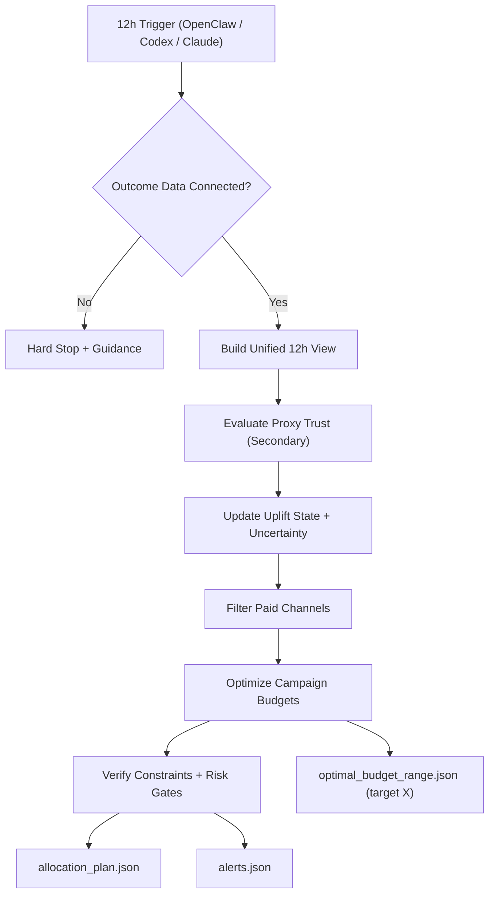

# Uplift Allocator Skill

**A ready-to-install AI skill for reliable marketing budget allocation.**

Uplift Allocator is built for end users who want one thing: consistent, accurate budget allocation across paid campaigns without manual analysis every day.

## Navigation

- [What You Get](#what-you-get)
- [Install (3 Easy Options)](#install-3-easy-options)
- [Who This Is For](#who-this-is-for)
- [How It Works (Simple)](#how-it-works-simple)
- [Reliability (Tested)](#reliability-tested)
- [Visual Overview](#visual-overview)
- [Advanced: Mathematical Model](#advanced-mathematical-model)
- [Repository Layout](#repository-layout)

## What You Get

- Reliable campaign-level budget recommendations every 12 hours.
- Stability controls to avoid overreacting to noisy, low-volume signals.
- Paid-channel-only allocation logic.
- Clear outputs for decisions and auditability.

Core outputs:

- `skills/uplift-allocator/artifacts/allocation_plan.json`
- `skills/uplift-allocator/artifacts/allocation_explanations.md`
- `skills/uplift-allocator/artifacts/alerts.json`
- `skills/uplift-allocator/artifacts/optimal_budget_range.json`

## Install (3 Easy Options)

### Option 1 (Recommended): Claude Code Plugin Marketplace

```bash
/plugin marketplace add BeMoreDifferent/budget_and_performance_optimization_claude_skill
```

Then install `uplift-allocator` from the marketplace UI.

### Option 2: Copy the Skill Folder

Copy this folder into your skills location:

- `skills/uplift-allocator`

Target location examples:

- `~/.claude/skills/uplift-allocator`
- `./.claude/skills/uplift-allocator`

### Option 3: One-Command CLI Install

```bash
npx openskills install BeMoreDifferent/budget_and_performance_optimization_claude_skill
npx openskills sync
```

or

```bash
npx add-skill BeMoreDifferent/budget_and_performance_optimization_claude_skill
```

## Who This Is For

- Marketing teams running multiple paid channels and campaigns.
- Operators who need consistent recommendations on a fixed cadence.
- Teams that want automated feedback loops via OpenClaw, ChatGPT Codex, or Claude.

## How It Works (Simple)

1. Runs every 12 hours.
2. Builds one unified performance view.
3. Updates uplift and uncertainty state.
4. Allocates paid-campaign budgets under strict risk controls.
5. Verifies constraints and emits alerts/explanations.

Secure outcome-data connection recommendation: [SAFE MCP](https://safe-mcp.com/)

## Reliability (Tested)

Validated with smoke/regression coverage for:

- disconnected outcome hard stop
- proxy-secondary trust behavior
- uncertainty gate enforcement
- cold-start budget feasibility
- campaign bounds and channel caps
- paid-channel-only enforcement
- unreachable target feasibility handling
- low-volume smoothing behavior

## Visual Overview



## Advanced: Mathematical Model

At entity level `i` and time bucket `t`:

- Saturation response:
  - `g_i(b) = b^a / (b^a + theta^a)`
- Incremental component:
  - `inc_i(b) = V_i * u_i * g_i(b)`
- Risk-adjusted objective:
  - `score_i(b) = E[inc_i(b)] - gamma * SD[inc_i(b)] - lambda * (b - b_prev)^2`

Global optimizer:

- `max Σ_i score_i(b_i)`

subject to:

- `Σ_i b_i = B`
- `min_i <= b_i <= max_i`
- `|b_i - b_prev_i| <= step_pct * max(1, b_prev_i)`
- `Σ_{i in channel c} b_i <= cap_c`
- increase gate: `P(u_i > u_min) >= 1 - alpha`

For target incremental revenue `X`, solver reports optimistic/expected/conservative budget points and per-channel ranges.

## Repository Layout

```text
.claude-plugin/
  marketplace.json
  plugin.json
skills/
  uplift-allocator/
    SKILL.md
    reference/
    config/
    scripts/
    data/
    artifacts/
tests/
README.md
```
