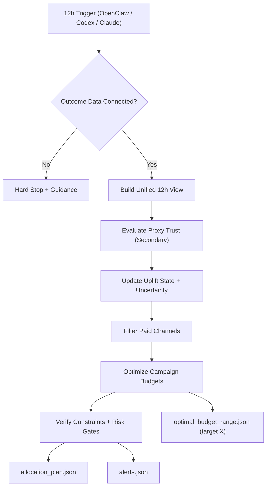

# Uplift Allocator Skill

**A ready-to-install AI skill for reliable marketing budget allocation.**

Uplift Allocator is built for end users who want one thing: consistent, accurate budget allocation across paid campaigns without manual analysis every day.

## Navigation

- [What You Get](#what-you-get)
- [Install (3 Easy Options)](#install-3-easy-options)
- [Who This Is For](#who-this-is-for)
- [How It Works (Simple)](#how-it-works-simple)
- [Reliability (Tested)](#reliability-tested)
- [Visual Overview](#visual-overview)
- [Tools and Functionalities (No Math)](#tools-and-functionalities-no-math)
- [Repository Layout](#repository-layout)
- [Appendix: Full Math Deep Dive](#appendix-full-math-deep-dive)

## What You Get

- A fully autonomous 12-hour feedback loop for paid marketing budget decisions.
- Consistent, research-backed allocation recommendations at campaign level.
- Lower decision risk through built-in stability controls and confidence guardrails.
- No proxy overreaction: supporting signals are treated as hints, not decision drivers.
- Paid-channel-only optimization so budget is not diluted into unpaid channels.
- Stakeholder-ready outputs for execution, reporting, and audit trails.

Core outputs:

- `skills/uplift-allocator/artifacts/allocation_plan.json`
- `skills/uplift-allocator/artifacts/allocation_explanations.md`
- `skills/uplift-allocator/artifacts/alerts.json`
- `skills/uplift-allocator/artifacts/optimal_budget_range.json`

## Install (3 Easy Options)

### Option 1 (Recommended): Claude Code Plugin Marketplace

```bash
/plugin marketplace add BeMoreDifferent/budget_and_performance_optimization_claude_skill
```

Then install `uplift-allocator` from the marketplace UI.

### Option 2: Copy the Skill Folder

Copy this folder into your skills location:

- `skills/uplift-allocator`

Target location examples:

- `~/.claude/skills/uplift-allocator`
- `./.claude/skills/uplift-allocator`

### Option 3: One-Command CLI Install

```bash
npx openskills install BeMoreDifferent/budget_and_performance_optimization_claude_skill
npx openskills sync
```

or

```bash
npx add-skill BeMoreDifferent/budget_and_performance_optimization_claude_skill
```

## Who This Is For

- Marketing teams running multiple paid channels and campaigns.
- Operators who need consistent recommendations on a fixed cadence.
- Teams that want automated feedback loops via OpenClaw, ChatGPT Codex, or Claude.

## How It Works (Simple)

1. Runs every 12 hours.
2. Builds one unified performance view.
3. Updates uplift and uncertainty state.
4. Allocates paid-campaign budgets under strict risk controls.
5. Verifies constraints and emits alerts/explanations.

Secure outcome-data connection recommendation: [SAFE MCP](https://safe-mcp.com/)

## Reliability (Tested)

Validated with smoke/regression coverage for:

- disconnected outcome hard stop
- proxy-secondary trust behavior
- uncertainty gate enforcement
- cold-start budget feasibility
- campaign bounds and channel caps
- paid-channel-only enforcement
- unreachable target feasibility handling
- low-volume smoothing behavior

## Visual Overview



## Tools and Functionalities (No Math)

This skill uses multiple internal tools together to deliver reliable budget allocation for marketing teams. It is based on strong scientific research in incrementality, uncertainty handling, and controlled optimization, but the output is simple to use.

1. **Outcome Data Gate**
- Checks if trusted outcome data is connected before any decision is made.
- If data quality is not good enough, it stops instead of producing risky recommendations.

2. **Unified Performance View**
- Combines campaign outcomes, spend, and supporting signals into one consistent view every 12 hours.
- This avoids conflicting dashboards and fragmented decision-making.

3. **Signal Quality Controller**
- Treats core business outcomes as primary.
- Treats proxy signals as secondary hints only.
- Prevents overreaction to noisy or low-volume changes.

4. **Budget Allocation Engine**
- Recommends budget shifts at campaign level for paid channels.
- Focuses on reliable improvement, not aggressive short-term swings.
- Supports both regular allocation and target-based planning (for a specific incremental revenue goal).

5. **Reliability Guardrails**
- Applies strict limits on how much budget can move in one cycle.
- Enforces channel and campaign constraints.
- Uses hold/alert logic when confidence is too low.

6. **Verification and Explainability**
- Validates every plan before it is accepted.
- Produces clear outputs for operations, stakeholders, and audit trails:
  - allocation plan
  - explanation summary
  - reliability alerts
  - target budget range output

7. **Automation-Ready Operation**
- Designed to run autonomously every 12 hours with OpenClaw, ChatGPT Codex, or Claude.
- Gives marketing teams consistent feedback loops without manual analyst-heavy workflows.

## Repository Layout

```text
.claude-plugin/
  marketplace.json
  plugin.json
skills/
  uplift-allocator/
    SKILL.md
    reference/
    config/
    scripts/
    data/
    artifacts/
tests/
README.md
```

## Appendix: Full Math Deep Dive

This section is optional and intended for readers who want the complete mathematical structure behind the skill.

### 1) Core objective

For campaign/entity `i` and budget `b_i`, the allocator maximizes total risk-adjusted incremental value:

- `max Σ_i score_i(b_i)`

with:

- `score_i(b_i) = E[value_i(b_i)] - gamma * SD(value_i(b_i)) - lambda * (b_i - b_prev_i)^2`

where:

- `gamma` controls risk aversion
- `lambda` controls budget inertia (change resistance)
- `b_prev_i` is previous cycle budget

### 2) Response curve (diminishing returns)

Budget impact uses a concave saturation function:

- `g_i(b) = b^a / (b^a + theta^a)`

with:

- `a` as curve shape parameter
- `theta` as saturation midpoint

Incremental contribution scales with uplift state:

- `inc_i(b) = V_i * u_i * g_i(b)`

where `V_i` is value-per-outcome scaling (revenue/purchase mapping).

### 3) Uplift state update

Each cycle estimates latent uplift `u_i` with uncertainty:

- posterior mean `u_mean_i`
- posterior std `u_sd_i`

The implementation combines:

- outcome-driven likelihood from trusted business outcomes
- conservative prior carry-over
- low-volume smoothing toward prior to reduce jitter

### 4) Proxy-secondary model policy

Proxies are never direct optimization targets.

Per entity information score `I_i` controls whether proxies are used:

- if outcome information is sufficient: proxies OFF
- if outcome information is weak: proxies ON as noisy indicators only

Proxy trust is conservative:

- high initial noise
- bounded trust updates
- floor/ceiling limits to avoid proxy dominance

### 5) Hard constraints

Allocation solves under strict constraints:

- total budget conservation:
  - `Σ_i b_i = B`
- campaign bounds:
  - `min_i <= b_i <= max_i`
- step limit:
  - `|b_i - b_prev_i| <= step_pct * max(1, b_prev_i)`
- channel caps:
  - `Σ_{i in channel c} b_i <= cap_c`
- paid-only policy:
  - only paid entities are eligible for allocation

### 6) Uncertainty gate for increases

Budget increases are allowed only when confidence is strong:

- increase `b_i` only if `P(u_i > u_min) >= 1 - alpha`

If confidence is below threshold, increases are held.

### 7) Target-based optimization (`X` incremental revenue)

For a target incremental revenue `X`, the solver sweeps feasible budgets and reports:

- optimistic budget point (upper uncertainty scenario)
- expected budget point (mean scenario)
- conservative budget point (lower uncertainty scenario)

This yields practical per-channel spend ranges instead of a brittle single-point recommendation.

### 8) Why this is reliable in production

The system combines:

- constrained optimization
- uncertainty-aware decisions
- proxy containment
- low-volume stabilization
- verification before acceptance

so autonomous 12-hour cycles remain stable, auditable, and decision-safe.
