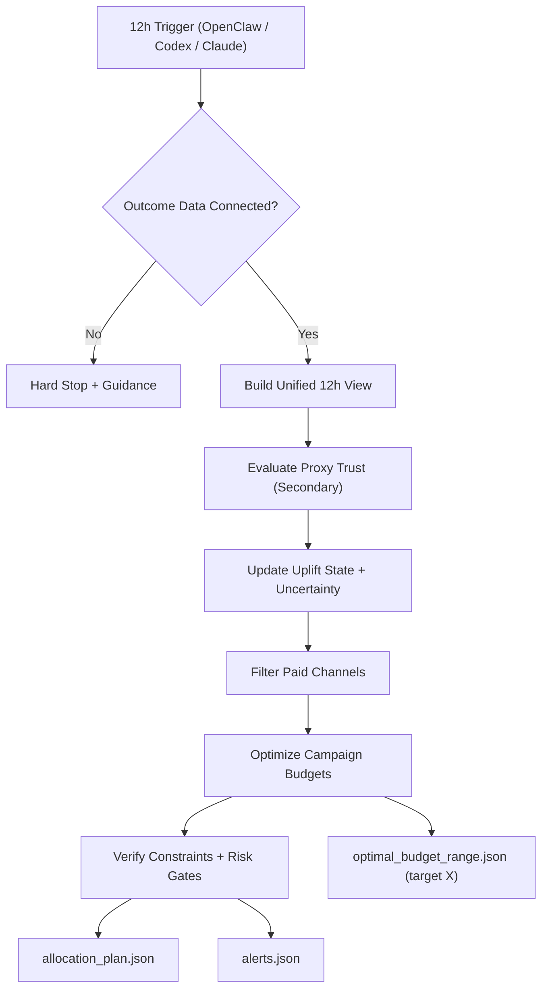

# Uplift Allocator Skill

**The fastest way to turn growth strategy into reliable campaign-level budget actions every 12 hours.**

Uplift Allocator is an AI-first, contract-first optimization skill for teams that need to scale paid growth without guesswork. It combines incremental uplift logic, strict risk controls, and paid-channel-only budget execution so business users can make faster decisions with higher confidence.
It is designed as a high-complexity optimization system for reliable steering of advertising accounts from strategy level to campaign level.
It is built and positioned as an **Agent Skill** for [AgentSkills.io](https://agentskills.io/home).

## 12-Hour AI feedback loop

This skill is designed for fully autonomous 12-hour execution by your preferred AI runtime:
- OpenClaw
- ChatGPT Codex
- Claude

Each autonomous cycle produces a fresh performance feedback package with budget recommendations, explanations, and risk alerts.

## Why this makes life better for business teams

- **Faster decisions with lower risk:** refreshes allocation logic every 12 hours without sudden swings.
- **More reliable than proxy-led optimization:** GA revenue/purchases are the source of truth; proxies are secondary indicators only.
- **Built for executive clarity:** outputs explainable plans, uncertainty-aware recommendations, and hard-fail alerts.
- **Protects spend quality:** enforces paid-channel-only allocation and blocks unsafe reallocations.
- **Supports growth + ROI together:** balances incremental upside, uncertainty, inertia, and churn constraints.

## Business value outcomes

- Improved budget efficiency across paid channels, audiences, and campaigns.
- More predictable performance in low-volume environments.
- Fewer reactive decisions driven by noisy short-term signals.
- Clearer communication between performance marketing, finance, and leadership.

## Core capabilities

1. **Outcome Data Gate**
- If outcome data is not connected, the run hard-stops to prevent low-trust optimization.
- Secure GA connection recommendation: [SAFE MCP](https://safe-mcp.com/).

2. **12-Hour Unified Growth View**
- Creates a consistent 12-hour view combining GA outcomes with optional spend and proxy data.

3. **Incremental Uplift Modeling**
- Uses GA outcomes to update uplift states and uncertainty per entity.
- Includes low-volume stabilization to avoid overreaction in sparse-conversion scenarios.

4. **Proxy-Secondary Policy**
- Proxies are used only when GA signal is insufficient.
- Proxy trust is conservative and bounded; proxies are never directly optimized.

5. **Campaign-Level Budget Allocation**
- Allocates at campaign granularity with uncertainty gates, step limits, inertia, and churn controls.
- Enforces bounds/caps and paid-channel-only execution.

6. **Optimal Budget Sweet-Spot for Target X**
- Given a target incremental revenue `X`, outputs:
  - optimistic budget point,
  - expected budget point,
  - conservative budget point,
  - per-channel recommended budget ranges.

## Mathematical deep dive

At entity level `i` and time bucket `t`:

- Saturation response:
  - `g_i(b) = b^a / (b^a + theta^a)`
- Incremental value component:
  - `inc_i(b) = V_i * u_i * g_i(b)`
- Risk-adjusted score:
  - `score_i(b) = E[inc_i(b)] - gamma * SD[inc_i(b)] - lambda * (b - b_prev)^2`

The optimizer allocates budget across campaigns by maximizing total score:

- `max Σ_i score_i(b_i)`

subject to hard constraints:

- `Σ_i b_i = B`
- per-campaign bounds: `min_i <= b_i <= max_i`
- step constraint: `|b_i - b_prev_i| <= step_pct * max(1, b_prev_i)`
- channel caps: `Σ_{i in channel c} b_i <= cap_c`
- uncertainty gate for increases: allow `b_i > b_prev_i` only if `P(u_i > u_min) >= 1 - alpha`

For target incremental revenue `X`, budget sweep is solved over feasible `B` and reports:

- optimistic budget (`u + z*sd`)
- expected budget (`u`)
- conservative budget (`max(0, u - z*sd)`)

This produces robust budget ranges rather than single-point recommendations.

## Reliability deep dive (tested)

Reliability is enforced by design and validated with smoke/regression tests:

- hard stop when outcome source is disconnected
- proxy-secondary behavior with conservative trust updates
- proxy gating based on information score
- uncertainty gate blocks unsafe budget increases
- cold-start budget feasibility in ad-account mode
- campaign bounds and channel caps enforced
- paid-channel-only enforcement
- optimizer feasibility flags for unreachable targets
- low-volume smoothing toward prior state

Validation is part of the engineering control system so autonomous runs remain consistent and auditable.

## Logical hierarchy

1. **Data trust layer**
- outcome connectivity gate
- unified 12-hour data view

2. **Signal quality layer**
- outcome-first modeling
- proxy-secondary checks
- low-volume stabilization

3. **Decision layer**
- risk-adjusted campaign allocation
- step/churn/inertia control
- bounds and cap enforcement

4. **Governance layer**
- verification and hard-fail alerts
- explainability artifacts
- target-`X` feasibility outputs

## Visual overview



## Ideal use cases

- Growth teams running multi-channel paid acquisition.
- Teams with low-to-mid conversion volumes needing stable recalculations.
- Organizations needing defensible, auditable budget steering logic.
- Businesses scaling performance marketing with stronger statistical discipline.

## Keywords and tags

`marketing`, `ai`, `claude`, `skills`, `codex`, `chatgpt`, `openclaw`, `growth`, `performance`, `budget`, `campaigns`, `incrementality`, `analytics`, `ga4`, `automation`, `feedback`, `mcp`, `secure`

## Folder layout

```text
uplift-allocator/
  SKILL.md
  README.md
  reference/
  config/
  scripts/
  data/
  artifacts/
  tests/
```

## Autonomous execution model

- AI agent owns orchestration, execution, and feedback generation.
- Mathematical constraints and gating logic enforce consistency.
- Human users consume outputs, not operational commands.

## Core outputs

- `uplift-allocator/artifacts/allocation_plan.json`
- `uplift-allocator/artifacts/allocation_explanations.md`
- `uplift-allocator/artifacts/alerts.json`
- `uplift-allocator/artifacts/optimal_budget_range.json` (when target `X` is provided)

Runtime artifacts are gitignored by default (except GA connection status).
